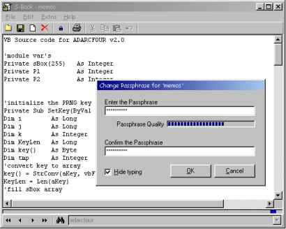



## S\-Book v4\.0 Secure Notebook

### Description

S-Book is a secure notebook to store collections of notes, protected by strong encryption. An S-book file can contain a large numbers of notes with all kinds of information such as addresses, things to remember or confidential stuff. An easy and clear user interface lets you add, delete or edit the individual notes in the S-Book file. No messing with opening, encrypting and saving files. Your data is protected by a passphrase, and changes to your notes are automatically encrypted and saved when you exit the program. On start-up, the program automatically loads the S-Book file that contains all your notes. With the navigation buttons and nav-bar you surf through your notes or you can go directly to the desired note by using the handy search function with up to three keywords. This enables you to find a particular note within seconds in a collection of thousands of notes. To protect your data the S-Book file is encrypted with ADARCFOUR, a strong, reliable and fast encryption algorithm. S-Book is the ideal solution to manage and store all kinds your-eyes-only information. S-Book uses ADARCFOUR, an advanced version of ARCFOUR (Alleged RC4). Being a stream cipher, ARCFOUR had some major disadvantages. One of them is that the key can only be used once. With ADARCFOUR, the transposition of the State Array values is influenced by a feedback from the data that is encrypted. Also, an Init Vector is added to the key and a random data prefix is used to ensure that each encryption is unique, even when the same data and key are used. To address the issue of attacks on the ARCFOUR key the ADARCFOUR key setup loop is repeated 24 times. The S-Book software also ensures that weak or repetitive keys are refused. These improvements make ADARCFOUR a fast, reliable and highly secure cipher. *** jun 5: small update on project form paths and delare vars
 
### More Info
 

             |
---                |---
**Submitted On**   |2007-06-02 16:23:48
**By**             |[D\. Rijmenants](https://github.com/Planet-Source-Code/PSCIndex/blob/master/ByAuthor/d-rijmenants.md)
**Level**          |Intermediate
**User Rating**    |5.0 (20 globes from 4 users)
**Compatibility**  |VB 5\.0, VB 6\.0
**Category**       |[Encryption](https://github.com/Planet-Source-Code/PSCIndex/blob/master/ByCategory/encryption__1-48.md)
**World**          |[Visual Basic](https://github.com/Planet-Source-Code/PSCIndex/blob/master/ByWorld/visual-basic.md)
**Archive File**   |[S\-Book\_v4\_206928652007\.zip](https://github.com/Planet-Source-Code/d-rijmenants-s-book-v4-0-secure-notebook__1-68732/archive/master.zip)

